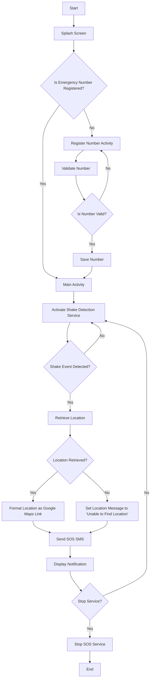

# SOS_Application
This  a SOS app for women’s safety using Java in Android Studio. The app sends the live location to saved emergency contacts when the phone is shaken.
# Flowchart

# Flowchart
```mermaid
%% UML Use Case Diagram for SOS Application

usecase
    actor User as "User"
    actor ShakeDetection as "Shake Detection Service"
    actor SMSService as "SMS Service"

    User --> (Launch Application)
    User --> (Register Emergency Contact)
    User --> (Shake Phone)

    (Launch Application) --> (Activate Shake Detection)
    (Activate Shake Detection) --> ShakeDetection
    (Shake Phone) --> ShakeDetection

    ShakeDetection --> (Retrieve Location)
    ShakeDetection --> (Send SOS SMS)

    (Retrieve Location) --> SMSService
    (Send SOS SMS) --> SMSService

    SMSService --> (Display Notification)

```


